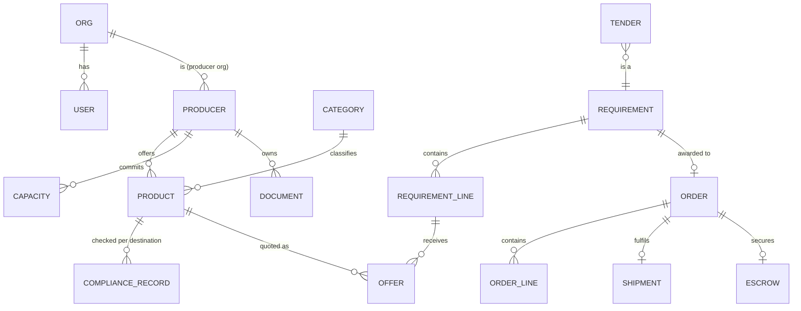
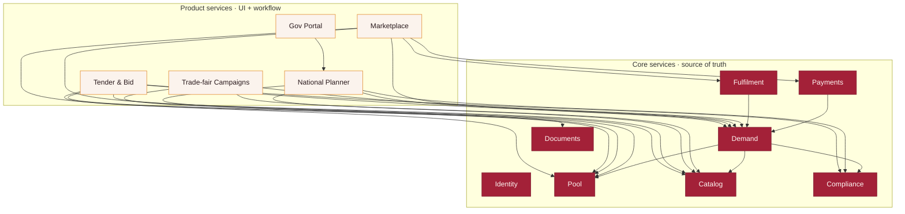

# Shuka — Shared Core Data Model & API Seams

**Status:** draft v0.1 · **Purpose:** define the shared data model and the service boundaries *before* the real build, so services can be developed and extracted independently and still merge cleanly.

This is the "seams first" document. Build as a **modular monolith**; treat every interface below as a **module boundary today** and a **network API later**. Extract a module into its own service only when it earns it (independent scale, separate team, or standalone sale).

---

## 1. Principles (the rules that keep it coherent)

1. **Single source of truth.** Every entity is *owned by exactly one core service*. No other service writes it; they call the owner's API.
2. **No shared tables.** Services never reach into each other's storage. They talk only through the contracts in §6.
3. **Demand is one abstraction.** Marketplace RFQs, public/private tenders, and trade-fair pre-orders are all `Requirement`s. They converge into the *same* downstream pipeline: offers → order → escrow → shipment. This is the single most important design decision — it stops the platform fragmenting into disconnected products.
4. **Compliance is a shared gate, never duplicated.** One engine produces `ComplianceRecord`s; onboarding, tenders, bid-desk, national-plan all *read* them.
5. **Money & time discipline.** Money = integer minor units + ISO-4217 currency, always. Timestamps = UTC ISO-8601. IDs = prefixed, globally unique, stable.
6. **Events for loose coupling.** State changes emit domain events (§7); edge services react rather than poll.
7. **Human-gated where it matters.** Automated drafting (e.g. tender applications) never auto-commits a legal/financial action; compliance + capacity confirmation gate submission.

---

## 2. Core entities

Concise TypeScript-style signatures. `Ref` = a stable ID string owned elsewhere.

```ts
type ISODate = string;      // UTC ISO-8601
type Money   = { amount: number; currency: 'EUR'|'USD'|'AMD' }; // amount in minor units

// --- Identity ---
interface User { id: `usr_${string}`; email: string; orgId: Ref;
  roles: ('producer'|'buyer'|'ops'|'gov_partner'|'investor'|'admin')[]; createdAt: ISODate; }
interface Org  { id: `org_${string}`; name: string;
  kind: 'producer'|'buyer'|'authority'|'internal'; country: string; }

// --- Pool (producers & capacity) ---
interface Producer { id: `prd_${string}`; orgId: Ref; name: string; region: string;
  kind: 'grower'|'winemaker'|'food'|'artisan';
  status: 'prospect'|'onboarding'|'active'|'suspended';
  certifications: Ref[];            // -> Document
  payoutRef?: string;               // opaque token from Payments/provider
  createdAt: ISODate; }
interface Capacity { producerId: Ref; skuId: Ref; period: string; // e.g. '2026-Q4'
  available: number; committed: number; unit: string; }

// --- Catalog (products & taxonomy) ---
interface Category { id: `cat_${string}`; name: string; animalOrigin: boolean;
  complianceProfile: Ref; }        // default rules bundle
interface Product { id: `sku_${string}`; producerId: Ref; categoryId: Ref;
  name: string; unit: string;
  attrs: { organic?: boolean; allergens?: string[]; ingredients?: string[] };
  footprint: { volumeM3: number; weightKg: number }; // per unit, for consolidation
  availability: { fromMonth: number; toMonth: number }; // 1..12
  status: 'draft'|'listed'|'delisted'; }

// --- Compliance (the gate) ---
type Verdict = 'eligible'|'needs_work'|'blocked';
interface ComplianceRecord { id: `cmp_${string}`; skuId: Ref;
  destination: 'EU'|'US'; verdict: Verdict;
  requirements: { severity:'ok'|'todo'|'risk'|'block'; label:string; detail:string }[];
  checkedAt: ISODate; expiresAt?: ISODate; }

// --- Demand (RFQ | tender | fair pre-order) ---
interface Requirement { id: `req_${string}`;
  source: 'marketplace'|'tender'|'fair';
  buyerRef?: Ref; destination: 'EU'|'US';
  lines: RequirementLine[];
  status: 'open'|'matching'|'quoting'|'awarded'|'closed';
  deadline?: ISODate; createdAt: ISODate; }
interface RequirementLine { id: `rql_${string}`; categoryId: Ref;
  quantity: number; unit: string; window?: string; }
interface Tender extends Requirement {         // specialization of Requirement
  source: 'tender'; sourceUrl: string; authority: string;
  tenderType: 'public'|'private'; bidBondRequired: boolean;
  documents: Ref[]; bidStatus: 'new'|'reviewing'|'bid_submitted'|'won'|'lost'|'blocked'; }

interface Offer { id: `off_${string}`; requirementLineId: Ref; producerId: Ref; skuId: Ref;
  price: Money; quantityAvailable: number; leadTimeWeeks: number;
  status: 'submitted'|'approved'|'rejected'|'withdrawn'; }

// --- Order (approved offers -> consolidated order) ---
interface Order { id: `ord_${string}`; requirementId: Ref; buyerRef: Ref;
  lines: OrderLine[];
  status: 'draft'|'funded'|'in_fulfilment'|'delivered'|'settled'|'disputed';
  shipmentRef?: Ref; escrowRef?: Ref; totals: { goods: Money; duty: Money; freight: Money }; }
interface OrderLine { offerRef: Ref; producerId: Ref; skuId: Ref;
  quantity: number; landedUnitCost: Money; }

// --- Fulfilment (physical) ---
interface Shipment { id: `shp_${string}`; orderId: Ref;
  route: { origin: string; destination: string };
  stage: 'confirmed'|'at_hub'|'qc'|'loaded'|'export_cleared'|'in_transit'
        |'import_cleared'|'out_for_delivery'|'delivered';
  milestones: { stage: string; at: ISODate; location: string }[];
  etaAt: ISODate; container: { fillVolumePct: number; weightKg: number }; }

// --- Payments (escrow) ---
interface Escrow { id: `esc_${string}`; orderId: Ref; total: Money;
  state: 'pending'|'held'|'released'|'refunded'|'disputed';
  providerRef: string;             // Mangopay / Lemonway id
  splits: { producerId: Ref; amount: Money; released: boolean }[]; }

// --- Documents (bid & compliance assets) ---
interface Document { id: `doc_${string}`;
  ownerRef: Ref;                   // producer | org | consortium
  type: 'profile'|'haccp'|'organic'|'origin'|'compliance_dossier'
       |'capacity_letter'|'pricing'|'reference'|'bid_bond';
  status: 'on_file'|'auto'|'per_producer'|'to_prepare';
  url?: string; validUntil?: ISODate; }
```

### Entity relationships



---

## 3. The unifying abstraction: Demand

The reason the platform stays one coherent thing instead of N disconnected products:

```
marketplace RFQ  ┐
public tender     ├──►  Requirement ──► Offer(s) ──► Order ──► Escrow ──► Shipment ──► settle
fair pre-order   ┘        (+lines)      (matched)   (approved)  (held)   (consolidated)
```

Every demand source produces a `Requirement`. Everything downstream — matching, offers, approval, consolidation, escrow, delivery — is written **once** and reused by all three. A tender is just a `Requirement` with extra fields (`sourceUrl`, `bidBond`, deadlines). This is what lets the Tender/Bid service be *extractable and sellable* while still sharing the core pipeline.

---

## 4. Services & ownership

**Core services** own data; **edge (product) services** own workflows and UI and consume the core.

| Service | Layer | Owns (source of truth) |
|---|---|---|
| **Identity** | core | User, Org, roles |
| **Pool** | core | Producer, Capacity |
| **Catalog** | core | Product, Category |
| **Compliance** | core | ComplianceRecord (the agent) |
| **Demand** | core | Requirement, Tender, Offer, Order |
| **Fulfilment** | core | Shipment, consolidation/logistics |
| **Payments** | core | Escrow (wraps provider) |
| **Documents** | core | Document library |
| **Marketplace** | edge | — (buyer console + producer portal UI) |
| **Tender & Bid** | edge | — (bid drafts; reads Demand/Compliance/Docs) |
| **National Planner** | edge | — (read-only aggregate over Catalog/Capacity/Compliance/Demand) |
| **Trade-fair Campaigns** | edge | — (creates Requirements from pre-orders) |
| **Gov Portal** | edge | — (scoped read of Planner) |



---

## 5. API seams (the contracts)

Interface-level; transport-agnostic (in-process calls now, HTTP/gRPC later). Errors and pagination omitted for brevity.

```ts
// Identity
Identity.authenticate(token): User
Identity.authorize(userId, action, resourceRef): boolean

// Pool
Pool.getProducer(id): Producer
Pool.listProducers(filter): Producer[]
Pool.getCapacity(producerId, period): Capacity[]
Pool.commitCapacity(producerId, skuId, period, qty): Capacity   // reserve for an order/bid

// Catalog
Catalog.getProduct(id): Product
Catalog.listProducts(filter): Product[]
Catalog.getCategory(id): Category

// Compliance  (the gate — read everywhere)
Compliance.check(skuId, destination): ComplianceRecord
Compliance.rulesFor(categoryId, destination): Requirement[]     // requirement rules, not demand

// Demand  (marketplace + tenders + fairs, unified)
Demand.createRequirement(input): Requirement                   // source: marketplace|tender|fair
Demand.getRequirement(id): Requirement
Demand.matchProducers(requirementId): { line: Ref; candidates: Offer[] }[]
Demand.submitOffer(input): Offer
Demand.approveOffers(requirementId, offerIds[]): Order          // -> creates Order (draft)

// Fulfilment
Fulfilment.createShipment(orderId): Shipment                   // runs consolidation/bin-packing
Fulfilment.getShipment(id): Shipment
Fulfilment.advance(shipmentId, stage): Shipment

// Payments
Payments.fundEscrow(orderId): Escrow                           // buyer funds -> state 'held'
Payments.releaseEscrow(orderId, producerIds[]): Escrow         // on verified delivery
Payments.getEscrow(orderId): Escrow

// Documents
Documents.list(ownerRef, type?): Document[]
Documents.assembleBidPackage(tenderId, orderDraftRef): Document // the auto-application output
```

**Golden rule:** an edge service may only call the contracts above. If a workflow needs data an owner doesn't expose, extend the owner's contract — never read its store directly.

---

## 6. Domain events (loose coupling)

Emitted by the owning service; edge services subscribe.

| Event | Emitted by | Consumers (examples) |
|---|---|---|
| `producer.onboarded` | Pool | Marketplace, National Planner |
| `product.listed` | Catalog | Compliance (auto-check), Planner |
| `compliance.checked` | Compliance | Onboarding, Tender, Bid-desk |
| `requirement.created` | Demand | Marketplace, Tender, matching jobs |
| `order.approved` | Demand | Payments (invite fund), Fulfilment |
| `escrow.funded` | Payments | Fulfilment (release producers to produce) |
| `shipment.advanced` | Fulfilment | Marketplace, tracking UI, buyer/producer notify |
| `shipment.delivered` | Fulfilment | Payments (trigger release), References/Docs |
| `escrow.released` | Payments | Pool (payout), Documents (build reference) |

---

## 7. Conventions

- **IDs**: `<prefix>_<ksuid>` — sortable, stable, never reused. Prefixes in §2.
- **Money**: `{ amount: minorUnits, currency }`. Never floats. FX handled only in Payments.
- **Time**: UTC ISO-8601 everywhere; localize only at the UI edge.
- **Status enums** are closed sets (§2); transitions validated by the owning service.
- **Multi-currency**: quotes/offers may be EUR/USD/AMD; Order totals normalize to the buyer's currency at approval time (rate stamped on the Order).
- **Soft-delete / audit**: entities are versioned; nothing is hard-deleted (tender/audit trails matter).

---

## 8. Build & extraction strategy

1. **Modular monolith first.** One deployable, one database, but the module boundaries above are enforced in code (separate packages/schemas; only public contracts imported across modules).
2. **Concierge before automation.** The first real corridor can run semi-manually (ops tooling over the same data model). Automate a step only once its manual version works.
3. **Extraction order** (extract only when earned):
   1. **Compliance** — cleanly bounded, read-only-ish, reusable → easy first extraction; also sellable as *compliance-as-a-service*.
   2. **Tender & Bid** — the strongest standalone/sellable product; already has clean inputs (tender + goods + dossier + capacity).
   3. **Payments** — likely externalized early anyway (regulated provider).
4. **Extraction rule:** extract a module when *one* is true — it needs independent scaling, a separate team owns it, or it's being sold standalone. Otherwise leave it in the monolith.

---

## 9. Prototype → service mapping

The current clickable prototypes (`getshuka.com`) map onto this model as follows — proof the seams already exist implicitly:

| Prototype | Primarily exercises |
|---|---|
| Compliance agent (`/tools/compliance.html`) | **Compliance** |
| Producer onboarding (`/tools/onboarding.html`) | **Pool + Catalog + Compliance** |
| Consolidated order console (`/tools/order-console.html`) | **Demand + Fulfilment (consolidation) + Payments** |
| Order lifecycle (`/tools/lifecycle.html`) | end-to-end **Demand → Payments → Fulfilment** |
| Shipment tracking (`/tools/tracking.html`) | **Fulfilment + Payments** |
| Tender board (`/tools/tenders.html`) | **Demand(tender) + Compliance + Pool** |
| Bid desk (`/tools/bid-desk.html`) | **Documents + Demand(tender) + Compliance + Capacity** |
| Trade-fair campaigns (`/tools/trade-fairs.html`) | **Demand(fair) + Catalog + Pool** |
| National export plan (`/tools/national-plan.html`) | aggregate read over **Catalog + Capacity + Compliance + Demand** |
| Year import planner (`/tools/planner.html`) | **Catalog (availability) + Demand (seasonality)** |
| Architecture map (`/tools/architecture.html`) | conceptual overview |

---

*Next: turn the §5 contracts into an OpenAPI/typed package, and stub the modular-monolith skeleton (one module per core service) when the first real corridor is ready to build.*
